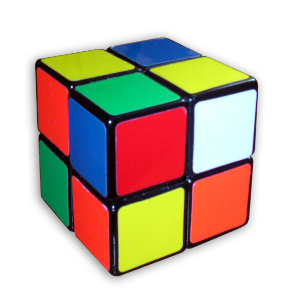
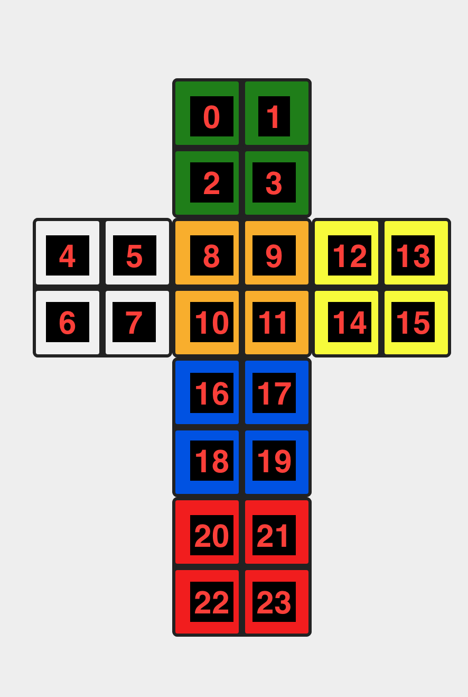

This program is a solver for a 2x2x2 Rubik's cube:



The solver's output uses 3 kinds of moves:

- "U": a 90 degree clockwise turn of the upper face
- "R": a 90 degree clockwise turn of the right face
- "B": a 90 degree clockwise turn of the back face

To use the solver, tell it the colors of the stickers on each face of the cube, then make the turns it indicates. For example, the output "UUURBBRRBRBBRBB" means to turn the upper face clockwise 90 degrees 3 times (i.e. 270 degrees), then the right face clockwise once (i.e. by 90 degrees), etc, until you finally turn the back face clockwise by 90 degrees twice (i.e. by 180 degrees). During these turns, the lower-left corner of the cube should stay in the same position.

Here's the order in which to enter the colors of the stickers. Imagine that the solved 2x2x2 cube were made out of 6 sheets of stiff paper taped together at the edges. Suppose the orange face were on top and the white face were on your left. Suppose you removed certain pieces of tape and unfolded the cube into a T shape and laid it flat on the table. The result would look like this:



(The image is a screenshot of https://rubiks-cube-solver.com/2x2/ with added numbers.)

The solver would refer to the individual stickers on the cube by number as follows:

         0   1
         2   3

    4 5  8   9  12 13
    6 7  10 11  14 15

         16 17 
         18 19 

         20 21
         22 23

So 8, 9, 10, and 11 are always the stickers on top; 4, 5, 6, and 7 are the stickers on the left side, and so on.

To run the solver, imagine that the cube has been unfolded, and enter the colors on each face, starting with stickers 0, 1, 2, 3, ... and ending with sticker 23.  You can use any letters you like for the colors, provided you use the same letter for each of the four stickers of each color. I use "W" for white, "R" for red, "O" for orange, "Y" for yellow, "G" for green, and "B" for blue.

Here's an example usage of the program:

```
go run rubik.go WROOOYRRGGGGWBRYWYBOYBBW
```

And here's the example output:

```
WROO OYRR GGGG WBRY WYBO YBBW --> [15 moves: "UUURBBRRBRBBRBB"] --> WWWW OOOO GGGG RRRR YYYY BBBB
```
